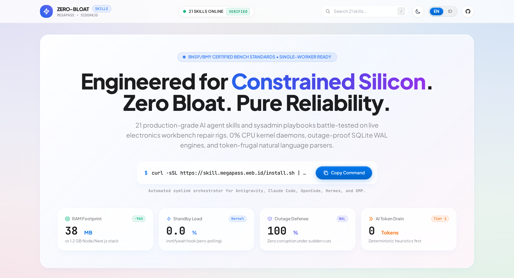
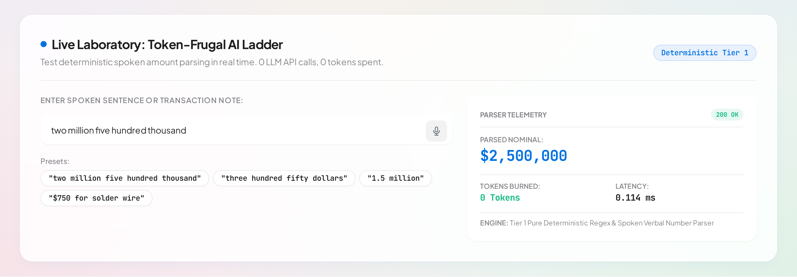
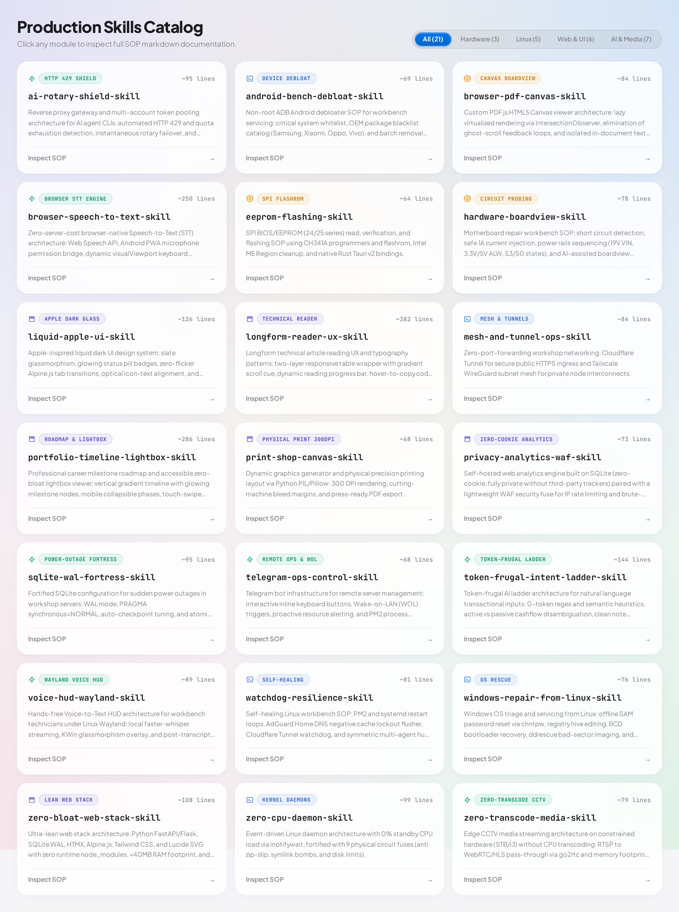
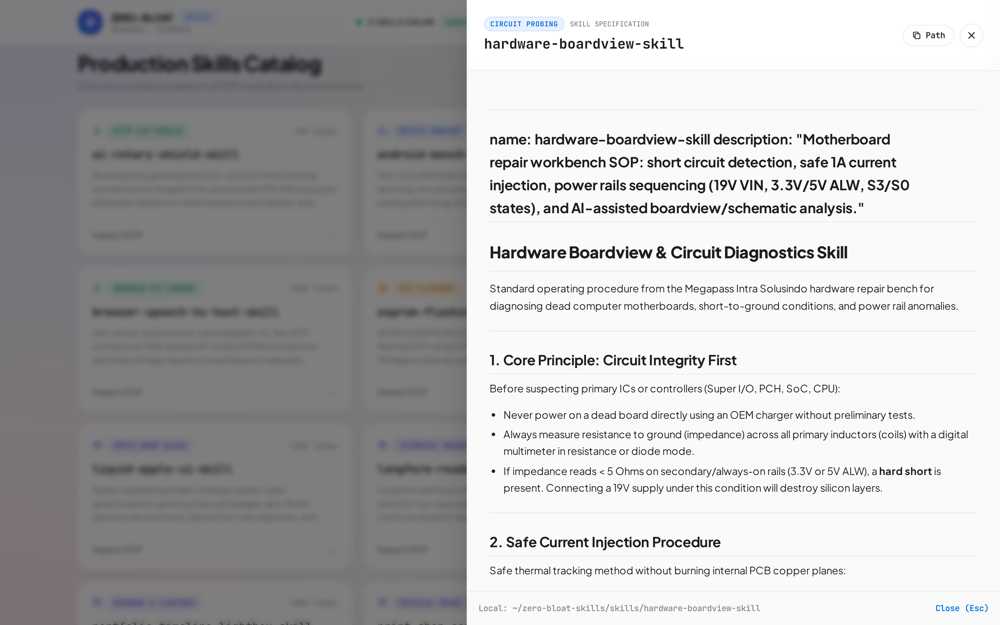

<div align="center">

# ZERO-BLOAT-SKILLS

**21 Modul Keahlian Operasional Tingkat Sirkuit Meja Servis, Linux Bare-Metal, dan Multi-Agent AI Gateway**

[](https://skill.megapass.web.id)
[](https://megapass.web.id)
[](https://github.com/4ntiDandruff)
[](https://github.com/4ntiDandruff/zero-bloat-skills)
[](LICENSE)

<br/>

[](#)
[](#)
[](#)
[](#)
[](#)
[](#)

<br/>

[English](README.md) &bull; [Bahasa Indonesia](README.id.md) &bull; [Portal Web Interaktif](https://skill.megapass.web.id)

<br/>

<a href="https://skill.megapass.web.id">
  
</a>

</div>

---

Koleksi skill ini tidak dirancang di atas server cloud berbayar mahal, melainkan ditempa dan diuji langsung di meja servis **Megapass Intra Solusindo (Sidoarjo, Indonesia)** di atas mesin Intel Core i3 lawas (RAM 7.6GB) untuk menangani diagnosa motherboard, flashing EEPROM, streaming CCTV edge, dan operasional harian ruko tanpa toleransi crash, kebocoran memori, atau dependensi node_modules yang membengkak.

Dapat dipasang dan dimuat secara otomatis oleh **Google Antigravity CLI**, **Claude Code**, **Oh My Pi (OMP)**, **OpenCode**, **Hermes Agent**, dan **Codex CLI**.

---

## ⚡ Instalasi Remote 1 Baris Perintah

Pasang dan hubungkan 21 modul keahlian ini ke seluruh AI coding agent yang terpasang di sistem Linux Anda hanya dengan satu baris perintah terminal:

```bash
curl -sSL https://skill.megapass.web.id/install.sh | bash
```

Atau lakukan clone manual dan jalankan skrip installer lokal:

```bash
git clone https://github.com/4ntiDandruff/zero-bloat-skills.git
cd zero-bloat-skills && chmod +x install.sh && ./install.sh
```

Untuk memperbarui seluruh modul kapan saja:

```bash
./install.sh --update
```

---

## 🌐 Portal Web Interaktif & Laboratorium Langsung

Jelajahi ekosistem modul ini secara visual di **[skill.megapass.web.id](https://skill.megapass.web.id)**:

* **Laboratorium Langsung: Tangga AI Hemat Token**: Uji coba langsung deteksi nominal percakapan sehari-hari dalam Bahasa Indonesia (IDR) dan English (USD) secara real-time dengan kecepatan sub-milidetik dan **0 panggilan API LLM, 0 token terkuras**.
* **Web Speech STT Native Browser**: Dikte percakapan hands-free langsung dari mikrofon peramban web dengan auto-deteksi bahasa.
* **Viewer SOP Lengkap**: Baca seluruh spesifikasi teknis dan SOP markdown dari ke-21 modul langsung di browser melalui slide-over drawer interaktif lengkap dengan tombol salin path dan kode.

<p align="center">
  <a href="https://skill.megapass.web.id">
    
  </a>
</p>

---

## 1. Topologi Sirkuit

```
  [ PERALATAN FISIK MEJA SERVIS ]
  ├── Multimeter & Lab Bench Power Supply (Injeksi Arus 1A)
  ├── CH341A USB SPI Flash Programmer (24/25 Series SOIC8)
  └── Ponsel Android & Laptop Servis Konsumen
                    ↓
  [ WORKSTATION LINUX MEJASERVIS (PC MICHAEL / I3-3240) ]
  ├── Kernel Inotify Daemons (0% CPU Standby Load)
  ├── Faster-Whisper Local Streaming (Wayland HUD Hands-Free)
  ├── Linux Repair Tooling (Reset SAM Password, Offline Registry, ddrescue)
  └── Multi-Account Rotary Shield Gateway (Anti-Limit HTTP 429)
                    ↓
  [ JARINGAN RUKO & AKSES JARAK JAUH ]
  ├── Cloudflare Tunnel (Ingress Publik HTTPS Tanpa Buka Port ISP)
  ├── Tailscale WireGuard Mesh (Interkoneksi Privat Antar Node)
  └── Telegram Inline Bot (Saklar Wake-On-LAN & Pemantau Beban Sistem)
                    ↓
  [ PENYIMPANAN DATA & WEB LEAN ]
  ├── SQLite WAL Fortress (Kebal Pemadaman Listrik Mendadak)
  └── Single-Worker FastAPI + HTMX + Alpine (Total RAM <50MB)
```

---

## 2. Matriks Lengkap 21 Modul Produksi

<p align="center">
  <a href="https://skill.megapass.web.id#catalog">
    
  </a>
</p>

### Hardware & Diagnosa Meja Kerja (3 Modul)

| Modul Keahlian | Kapabilitas Inti & Solusi Masalah | Pemicu Otomatis (Trigger R11) |
|---|---|---|
| [`hardware-boardview-skill`](skills/hardware-boardview-skill/SKILL.md) | Deteksi short circuit, suntik tegangan aman 1A, urutan rel daya motherboard (19V VIN, 3.3V/5V ALW, S3/S0), analisis skema & boardview. | `motherboard`, `korslet`, `short`, `suntik tegangan`, `skema rails` |
| [`eeprom-flashing-skill`](skills/eeprom-flashing-skill/SKILL.md) | Pembacaan, verifikasi, dan flashing SPI BIOS/EEPROM seri 24/25 via CH341A dan flashrom, pembersihan Intel ME Region corrupt. | `flash bios`, `eeprom`, `ch341a`, `dump corrupt`, `clean me` |
| [`windows-repair-from-linux-skill`](skills/windows-repair-from-linux-skill/SKILL.md) | Reset offline password SAM via chntpw, edit registry offline, pemulihan bootloader BCD, kloning bad sector via ddrescue. | `servis windows`, `reset password`, `sam`, `bcd boot`, `bad sector` |

### Linux Bare-Metal & Daemon (5 Modul)

| Modul Keahlian | Kapabilitas Inti & Solusi Masalah | Pemicu Otomatis (Trigger R11) |
|---|---|---|
| [`zero-cpu-daemon-skill`](skills/zero-cpu-daemon-skill/SKILL.md) | Daemon event-driven berbasis kernel inotifywait dengan 0% CPU standby dan 9 sekring pengaman sirkuit fisik. | `daemon inotify`, `pantau folder`, `0% cpu`, `sekring ekstraksi` |
| [`watchdog-resilience-skill`](skills/watchdog-resilience-skill/SKILL.md) | Penanganan crash loop PM2 & systemd, pembersihan negative cache DNS AdGuard Home, pengawas Cloudflare Tunnel. | `watchdog`, `resilience`, `dns lockout`, `pm2 restart loop` |
| [`mesh-and-tunnel-ops-skill`](skills/mesh-and-tunnel-ops-skill/SKILL.md) | Ingress publik HTTPS aman via Cloudflare Tunnel tanpa port forwarding ISP + interkoneksi privat Tailscale WireGuard. | `cloudflare tunnel`, `tailscale`, `port forwarding`, `wireguard` |
| [`telegram-ops-control-skill`](skills/telegram-ops-control-skill/SKILL.md) | Bot Telegram remote ops interaktif dengan inline keyboard, pemicu Wake-on-LAN (WOL), dan alert lonjakan beban server. | `bot telegram`, `tombol remote`, `wake on lan`, `bangunkan pc` |
| [`android-bench-debloat-skill`](skills/android-bench-debloat-skill/SKILL.md) | Pembersih bloatware ADB Android non-root untuk meja servis: whitelist sistem krusial dan katalog blacklist vendor (Samsung, Xiaomi, Oppo, Vivo). | `debloat android`, `hapus bloatware`, `hp lemot`, `adb` |

### Arsitektur Web & UI Cupertino (6 Modul)

| Modul Keahlian | Kapabilitas Inti & Solusi Masalah | Pemicu Otomatis (Trigger R11) |
|---|---|---|
| [`zero-bloat-web-stack-skill`](skills/zero-bloat-web-stack-skill/SKILL.md) | Arsitektur web SSR ultra-ramah RAM: FastAPI + SQLite WAL + HTMX + Alpine.js + Tailwind CSS (<40MB RAM, cold-start <100ms). | `fastapi`, `endpoint`, `router`, `backend python`, `web lean` |
| [`liquid-apple-ui-skill`](skills/liquid-apple-ui-skill/SKILL.md) | Desain UI Apple liquid dark: slate glassmorphism, badge pill menyala, transisi tab Alpine tanpa flicker, optical alignment. | `apple liquid ui`, `dark glass`, `status pill`, `desain agy router` |
| [`browser-pdf-canvas-skill`](skills/browser-pdf-canvas-skill/SKILL.md) | Viewer PDF.js Canvas virtual: rendering lazy via IntersectionObserver, pencegahan looping scroll hantu, isolasi pencarian teks. | `viewer pdf skema`, `canvas`, `scroll hantu`, `search part` |
| [`longform-reader-ux-skill`](skills/longform-reader-ux-skill/SKILL.md) | Tata letak pembaca teknis: gradien cue scroll tabel, reading bar progresif, hover tombol salin kode, skeleton shimmer. | `artikel panjang`, `tata letak blog`, `reader ux`, `table scroll` |
| [`portfolio-timeline-lightbox-skill`](skills/portfolio-timeline-lightbox-skill/SKILL.md) | Roadmap karier vertikal, fase collapsible, galeri foto lightbox zero-bloat dengan navigasi keyboard dan touch-swipe. | `roadmap karier`, `sertifikat`, `lightbox foto`, `galeri swipe` |
| [`print-shop-canvas-skill`](skills/print-shop-canvas-skill/SKILL.md) | Generator grafis percetakan fisik via Pillow: render presisi 300 DPI, margin bleed mesin potong, ekspor PDF CMYK. | `desain cetak`, `kartu garansi`, `kalender`, `300 dpi`, `bleed` |

### Tangga AI & Media Edge (7 Modul)

| Modul Keahlian | Kapabilitas Inti & Solusi Masalah | Pemicu Otomatis (Trigger R11) |
|---|---|---|
| [`token-frugal-intent-ladder-skill`](skills/token-frugal-intent-ladder-skill/SKILL.md) | Parsing nominal transaksi percakapan: tangga deterministik 0-token regex, pemisahan aktif vs pasif hutang-piutang, ekstraksi catatan bersih. | `tangga ai`, `parsing nominal`, `terbilang`, `hutang piutang` |
| [`ai-rotary-shield-skill`](skills/ai-rotary-shield-skill/SKILL.md) | Reverse proxy multi-akun rotary: deteksi dini HTTP 429 dan kuota habis, rotary failover instan tanpa jeda kerja agen. | `limit 429`, `kuota habis`, `resource exhausted`, `putar akun ai` |
| [`browser-speech-to-text-skill`](skills/browser-speech-to-text-skill/SKILL.md) | STT native browser tanpa server: Web Speech API, bridging izin mic PWA Android, penghindaran keyboard visualViewport. | `suara ke teks browser`, `web speech stt`, `dikte web`, `mic pwa` |
| [`voice-hud-wayland-skill`](skills/voice-hud-wayland-skill/SKILL.md) | HUD suara hands-free teknisi solder di Linux Wayland: streaming lokal faster-whisper dan overlay glass KWin. | `dikte suara`, `hands-free`, `voice hud`, `wayland`, `solder` |
| [`privacy-analytics-waf-skill`](skills/privacy-analytics-waf-skill/SKILL.md) | Engine analitik web lokal mandiri berbasis SQLite (zero-cookie, tanpa Google Analytics) + sekring WAF rate limiting IP. | `analitik pengunjung lokal`, `waf sekring`, `brute force ip` |
| [`sqlite-wal-fortress-skill`](skills/sqlite-wal-fortress-skill/SKILL.md) | Konfigurasi benteng SQLite kebal mati lampu: mode WAL, PRAGMA synchronous=NORMAL, auto-checkpoint, dan hot backup atomik. | `database`, `sqlite`, `wal`, `corrupt`, `backup` |
| [`zero-transcode-media-skill`](skills/zero-transcode-media-skill/SKILL.md) | Streaming CCTV edge hemat daya (STB/i3) tanpa transcode CPU: pass-through RTSP ke WebRTC/HLS via go2rtc (<30MB RAM). | `streaming cctv`, `stb edge`, `go2rtc`, `rtsp webrtc zero-transcode` |

<br/>

<p align="center">
  <a href="https://skill.megapass.web.id">
    
  </a>
</p>

---

## 3. Bedah Tech Stack Ramah Pemula

* **Frontend (Layar Depan)**:
  * **HTML5 (Kerangka)**: Server-Side Rendering (SSR) via Jinja2 untuk kecepatan tampil awal instan tanpa blank screen.
  * **Tailwind CSS (Tampilan)**: Standalone micro-bundle tanpa build-step Node.js yang membebani disk.
  * **Alpine.js & HTMX (Gerakan & Interaksi)**: Pertukaran data AJAX parsial langsung dari server tanpa menulis fetch API manual.
  * **Lucide SVG (Simbol)**: Ikon vektor inline murni tanpa icon-font berat atau emoji murahan.
* **Backend (Mesin Belakang)**:
  * **Python FastAPI / Flask**: Mode single-worker berkinerja tinggi, menghemat memori hingga <40MB RAM.
  * **Rust & Tauri v2**: Binding native biner ke hardware USB/serial tanpa runtime Electron.
* **Database (Penyimpanan Data)**:
  * **SQLite WAL Mode**: Arsitektur Write-Ahead Logging yang memisahkan arus baca dan tulis secara konkuren, dilengkapi proteksi integritas penuh saat arus listrik terputus mendadak.

---

## 4. Metrik & Benchmark Nyata

Data riil hasil pengujian pada server produksi meja servis Megapass (Intel Core i3-3240, RAM 7.6GB, Ubuntu 24.04 LTS):

| Indikator Evaluasi | Stack Standar Industri | Zero-Bloat Meja Servis | Efisiensi Riil |
|---|---|---|---|
| Konsumsi RAM Web App | 450 MB - 1.2 GB (Node/React/Postgres) | 36 MB - 48 MB (FastAPI + SQLite WAL) | Penghematan RAM hingga 92% |
| CPU Standby Load Daemon | 3% - 8% (Polling Loop `sleep`) | 0.0% (Kernel `inotifywait` event hook) | Nol beban prosesor di standby |
| Transcoding CCTV Edge | 85% CPU load (FFmpeg re-encoding) | 0.8% CPU load (go2rtc RTP pass-through) | CPU tetap dingin di edge STB |
| Ketahanan Mati Lampu | Risiko database locking / malformed | Aman 100% (WAL commit + PRAGMA NORMAL) | Zero corrupt transaction |
| Cold-Start Time | 3.5 - 8.0 detik | < 120 milidetik | Respons instan saat dipanggil |

---

## 5. Valuasi Rekayasa

Tabel perbandingan nilai rekayasa antara menggunakan jasa vendor/software house konvensional vs penerapan mandiri arsitektur `zero-bloat-skills`:

| Pos Kebutuhan Sistem | Metode Vendor / Software House | Metode Mandiri Zero-Bloat | Nilai Penghematan Riil |
|---|---|---|---|
| Server & Database Bulanan | Sewa VPS Cloud 8GB RAM + Managed DB: Rp 650.000 / bulan | PC Bekas Ruko (i3/STB) + SQLite WAL: Rp 0 (Lokal) | Hemat Rp 7.800.000 / tahun |
| Lisensi & Domain IP Publik | Sewa IP Publik Statis ISP: Rp 250.000 / bulan | Cloudflare Tunnel + Tailscale Subnet: Rp 0 | Hemat Rp 3.000.000 / tahun |
| Biaya Jasa Bikin Tool Servis | Pembuatan software desktop internal: Rp 15.000.000 | Ekstraksi 21 modul skill siap pakai: Gratis | Hemat Rp 15.000.000 (One-time) |
| Waktu Diagnosa Teknisi | Pelacakan manual tanpa AI/skema: ~90 menit/unit | Copilot boardview + injeksi arus: ~15 menit/unit | Menghemat 75 menit waktu kerja/unit |

---

## 6. Treeview Repositori

```
zero-bloat-skills/
├── LICENSE                               # Lisensi resmi MIT (Hizam Nahari / Megapass)
├── README.md                             # Dokumentasi komprehensif edisi global (English)
├── README.id.md                          # Dokumentasi edisi Bahasa Indonesia standar R8
├── install.sh                            # Installer universal multi-agent (symlink otomatis)
├── uninstall.sh                          # Skrip pencabutan symlink bersih
│
├── assets/                               # Tangkapan layar resolusi tinggi & showcase UI
│   ├── hero.png                          # Showcase hero portal web
│   ├── playground.png                    # Laboratorium Langsung Tangga AI Hemat Token
│   ├── catalog.png                       # Kisi kartu 21 modul keahlian
│   └── drawer.png                        # Slide-over reader spesifikasi SOP di browser
│
├── skills/                               # 21 Modul Keahlian Meja Servis & Zero-Bloat
│   ├── hardware-boardview-skill/         # Diagnosa short circuit, injeksi 1A, urutan rails
│   ├── browser-pdf-canvas-skill/         # PDF.js Canvas, lazy virtualization, anti-ghost-scroll
│   ├── eeprom-flashing-skill/            # Flashing SPI BIOS 24/25 via CH341A + Clean ME
│   ├── windows-repair-from-linux-skill/  # Reset password SAM, offline registry, ddrescue
│   ├── android-bench-debloat-skill/      # Debloat ADB tanpa root, whitelist paket vital
│   ├── zero-cpu-daemon-skill/            # Daemon inotifywait 0% CPU dengan 9 sekring sirkuit
│   ├── voice-hud-wayland-skill/          # HUD dikte suara teknisi hands-free via faster-whisper
│   ├── telegram-ops-control-skill/       # Tombol kontrol inline Telegram & Wake-on-LAN (WOL)
│   ├── ai-rotary-shield-skill/           # Rotary reverse proxy mitigasi batas limit HTTP 429
│   ├── watchdog-resilience-skill/        # Auto-heal PM2/systemd & flusher DNS AdGuard Home
│   ├── sqlite-wal-fortress-skill/        # SQLite WAL kebal mati lampu & online hot-backup
│   ├── zero-transcode-media-skill/       # Streaming CCTV edge tanpa transcode CPU
│   ├── mesh-and-tunnel-ops-skill/        # Ingress Cloudflare Tunnel + subnet privat Tailscale
│   ├── zero-bloat-web-stack-skill/       # FastAPI + Alpine + HTMX + Tailwind (<40MB RAM)
│   ├── privacy-analytics-waf-skill/      # Analitik web mandiri zero-cookie + sekring WAF
│   ├── print-shop-canvas-skill/          # Generator canvas Pillow presisi tinggi 300 DPI
│   ├── liquid-apple-ui-skill/            # Desain liquid Apple dark UI, status pill, Alpine tabs
│   ├── longform-reader-ux-skill/         # Cue scroll tabel, reading bar, salin kode, shimmer
│   ├── portfolio-timeline-lightbox-skill/# Roadmap pencapaian, collapsible phase, lightbox A11y
│   ├── browser-speech-to-text-skill/     # Web Speech STT nol server, mic PWA, nominal terbilang
│   └── token-frugal-intent-ladder-skill/ # Tangga regex 0-token, hutang vs piutang, clean note
│
└── examples/
    └── starter-app/                      # Demo aplikasi tiket siap jalan meja servis
        ├── main.py                       # Backend FastAPI single-worker
        ├── db.py                         # Inisialisasi SQLite WAL & pragma sirkuit
        ├── requirements.txt              # Dependensi runtime minimal
        ├── test_smoke.py                 # Uji verifikasi mandiri (exit code 0)
        └── templates/
            └── index.html                # UI SSR HTML + Tailwind + HTMX + Alpine
```

---

## 7. Smoke Test (Panduan Verifikasi Mandiri)

Uji validasi seluruh stack secara independen di komputer workstation lokal Anda:

```bash
# 1. Klon repositori
git clone https://github.com/4ntiDandruff/zero-bloat-skills.git
cd zero-bloat-skills

# 2. Hubungkan symlink modul ke seluruh coding agent yang terpasang
chmod +x install.sh
./install.sh

# 3. Jalankan uji verifikasi otomatis starter app
cd examples/starter-app
python3 test_smoke.py
```

Bukti nyata luaran terminal yang diharapkan:
```
[*] Menjalankan smoke test starter app...
[+] Test 1 PASS: /health aktif dan mode SQLite WAL terverifikasi.
[+] Test 2 PASS: GET / render HTML berhasil (FCP instant).
[+] Test 3 PASS: POST /tickets/add berhasil swap baris HTMX baru.
[+] Test 4 PASS: Data terverifikasi tersimpan atomik di SQLite WAL.

[+] SELURUH SMOKE TEST LOLOS DENGAN EXIT CODE 0.
```

---

## 8. Rencana Pengembangan (Roadmap)

* **Fase 1 (Rilis Saat Ini)**: Paket 21 modul keahlian produksi, installer symlink multi-agent, portal web interaktif live di `skill.megapass.web.id`, dan starter app meja kerja.
* **Fase 2 (Berikutnya)**: Generator otomatis konfigurasi reverse-proxy zero-bloat untuk Caddy, Nginx, dan Traefik.
* **Fase 3 (Jangka Panjang)**: Biner CLI mandiri `zero-bloat` berbasis Rust untuk scaffolding instan proyek nol-dependensi dan probing alat ukur perangkat keras meja servis.

---

<div align="center">

Megapass Intra Solusindo • Sidoarjo, Indonesia

</div>
